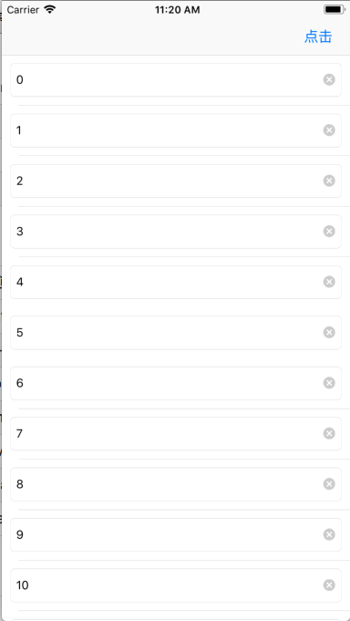

# ScrollViewAutoAdjust

一行代码自动调整位于 ScroollView 上的 UItextField 的位置，使其不被键盘遮挡。

## 适用场景

适用于 UIScroollView 的子视图中有 UItextField 或者 UITextView 并且键盘弹出后其会被遮挡住的情况。比如 UItextField 或者 UITextView 直接加到 UIScroollView 上，或者 UITableView 的 cell 中有 UItextField 或者 UITextView。

## 使用

初始化的时候设置属性 isAutoAdjust 为 YES 。

```
self.tableView.isAutoAdjust = YES;
```

好吧，做了一回标题党。其实你还得写下面这行代码。

dealloc 中设置属性 isAutoAdjust 为 NO 。

```
- (void)dealloc
{
    self.tableView.isAutoAdjust = NO;
}
```

这么做的目的主要是为了移除通知，具体可以看下面的实现思路。

## 实现思路

我们在做需求的时候难免会遇到下面这种输入表格。让我们比较头疼的就是怎么不让键盘挡住我们正在输入的文本框。



之前我用的方法都是在文本框的代理方法中进行处理，但是处理起来相当麻烦，而且写出来的代码也比较难看。后来又通过监听键盘弹出收起的通知来挨个处理，也比较麻烦。有没有什么简单的方法呢？

其实解决的思路涉及到三个知识点。
1. 键盘通知
2. 获取当前第一响应者
3. UIView 的坐标转换

### 键盘通知
当键盘弹出和收起的时候会发出通知，比如 `UIKeyboardWillShowNotification` 或者 ` UIKeyboardWillHideNotification`。

通过监听这些通知可以获取键盘高度，动画时间等数据。

```
    UIKeyboardAnimationCurveUserInfoKey = 7;
    UIKeyboardAnimationDurationUserInfoKey = "0.25";
    UIKeyboardBoundsUserInfoKey = "NSRect: {{0, 0}, {414, 271}}";
    UIKeyboardCenterBeginUserInfoKey = "NSPoint: {207, 871.5}";
    UIKeyboardCenterEndUserInfoKey = "NSPoint: {207, 600.5}";
    UIKeyboardFrameBeginUserInfoKey = "NSRect: {{0, 736}, {414, 271}}";
    UIKeyboardFrameEndUserInfoKey = "NSRect: {{0, 465}, {414, 271}}";
    UIKeyboardIsLocalUserInfoKey = 1;

```

### 获取当前第一响应者
当一个文本框进入输入状态的时候回成为第一响应者。这时候想要获取文本框就需要找到第一响应者。

有以下几种思路可以获取第一响应者
1. 遍历

通过遍历当前UIWindow的所有子视图，从而找到当前的第一响应者。

缺点就是需要自己写很多的递归调用，还需要去除响应者链条上的非 UIView 类。

2. 私有 API
可以通过下面的方法来获取。
```
UIWindow *keyWindow = [[UIApplication sharedApplication] keyWindow];
UIView *firstResponder = [keyWindow performSelector:@selector(firstResponder)];
```
缺点是苹果不让用这种私有 API。而且这些 API 可能随时被废弃掉。

3. UIResponder 方法

这是 [这篇文章](https://www.jianshu.com/p/84c0eddf2378) 中作者提出的方法，很是好用。

基本是来说就是利用了 UIResponder 方法

```
- (BOOL)sendAction:(SEL)action to:(id)target from:(id)sender forEvent:(UIEvent *)event
```
官方描述
> The object to receive the action message. If target is nil, the app sends the message to the first responder, from whence it progresses up the responder chain until it is handled.

> 利用该API，只要将传入的target设置为nil，则系统会自动顺着响应链查找能够响应action的响应者。我们只需让所有UIResponder的子类都响应我们自定义的action，即可知道当前第一响应者是哪个对象。

完美。

### UIView 的坐标转换
这是 UIView 的方法，可以转换 view 的坐标到相应的 view 中去。

```
- (CGRect)convertRect:(CGRect)rect fromView:(UIView *)view;
```

比如上面图片中的 UItextField 的父视图是 cell 的 contentView。 想要获取 UItextField 在 UITableView 中相对位置就需要做如下的转换

```
[self.tableView convertRect:textField.frame fromView:textField.superview];
```

更具体的说明可以看 [这里](https://www.jianshu.com/p/92e2d0200eb4)

## 实现代码

有了上面的思路就可以进行编码了。

为 UIScrollView 添加一个分类，通过关联属性给 UIScrollView 添加一个监听通知的开关。

然后在收到通知后获取第一响应者和坐标，然后调整 scrollView 的 contentOffset。

```
- (void)keyboardWillShow:(NSNotification *)notice
{
    if (!self.isAutoAdjust) return;
    
    NSValue *aValue = [notice.userInfo objectForKey:UIKeyboardFrameEndUserInfoKey];
    CGRect keyboardRect = [aValue CGRectValue];
    CGFloat keyboardHeigth = keyboardRect.size.height;
    
    UIView *textField = [UIResponder getCurrentFirstResponder];
    CGRect textFieldFrame = [self convertRect:textField.frame fromView:textField.superview];
    CGFloat maxY = CGRectGetMaxY(textFieldFrame);
    
    UIWindow *keyWindow = [UIApplication sharedApplication].keyWindow;
    CGRect selfRect = [keyWindow convertRect:self.frame fromView:self.superview];
    // scrollView 距屏幕底部的间距
    CGFloat bottomMarge = keyWindow.frame.size.height - CGRectGetMaxY(selfRect);
    
    // 会被遮挡的高度
    CGFloat coverHeight = keyboardHeigth - bottomMarge;
    // 要完全显示时需要调整的 contentOffset y
    CGFloat adjustContentOffsetY = coverHeight + maxY - self.frame.size.height;
    
    if (self.contentOffset.y < adjustContentOffsetY ) {
        [self setContentOffset:CGPointMake(0, adjustContentOffsetY) animated:NO];
    }
}
```

键盘收起的时候如果之前滚动的 contentOffset 超出了最大值需要从新调整下 contentOffset。
```
- (void)keyboardWillHide:(NSNotification *)notice
{
    if (!self.isAutoAdjust) return;
    
    if (self.contentOffset.y > self.contentSize.height - self.frame.size.height) {
        [self setContentOffset:CGPointMake(0, self.contentSize.height - self.frame.size.height) animated:YES];
    }
}
```

额外需要说明两点

1. 其实还可以通过 Method Swizzling 来替换 dealloc 方法，移除监听。但是这样有额外的风险，用在这里有点小题大做了。

2. 在 iOS 某个版本后通知的监听不移除也不会出现问题。我试验了 iOS11 和 iOS12 都不会有问题。但是...安全起见还是加上移除监听的代码吧。（[这篇文章](https://juejin.im/entry/5a8fe5c551882518c0797ebe)有详细的说明）

## 参考
1. [一行代码获取当前响应链的First Responder](https://www.jianshu.com/p/84c0eddf2378)
1. [iOS开发常用方法--坐标转换](https://www.jianshu.com/p/92e2d0200eb4)
1. [透彻理解 NSNotificationCenter 通知](https://juejin.im/entry/5a8fe5c551882518c0797ebe)
